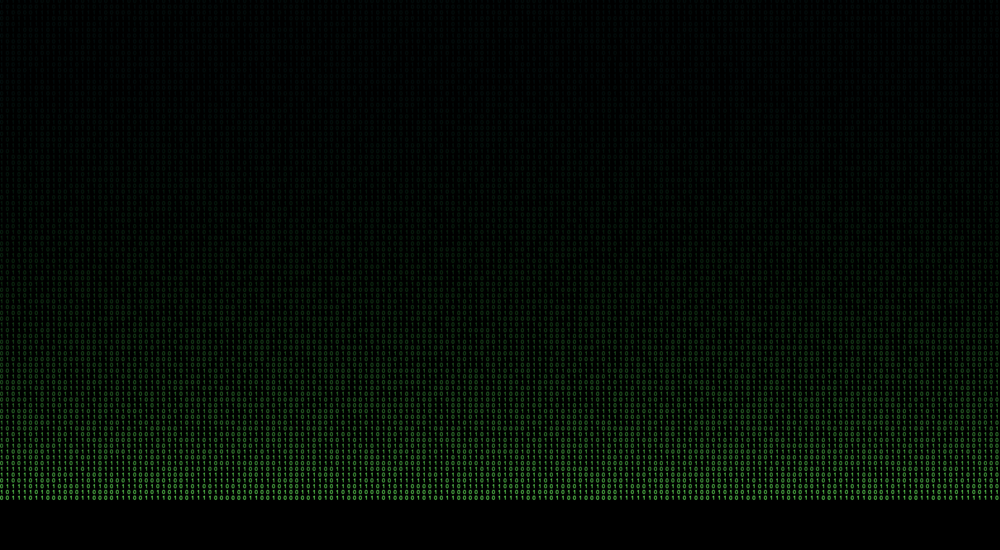

# matrix
**[The Matrix](https://www.imdb.com/title/tt0133093/?ref_=nv_sr_srsg_1_tt_6_nm_1_in_0_q_The%2520Matrix)**: *Matrix Digital Rain*  (web-based green code rain) | [Live view of The Matrix](https://hongbo-wei.github.io/matrix.html)

This repository contains a simple web page that simulates the famous "digital rain" effect seen in the film *The Matrix*. The effect is implemented using HTML5's `<canvas>` element and JavaScript.


## Features

- Full-screen canvas that dynamically adjusts to the browser window.
- Digital rain effect with a continuous stream of binary numbers (`0` and `1`), rendered in a Matrix-like green colour.
- Smooth animation with cascading symbols that reset randomly, creating a dynamic and scattered visual.

## Demo

The digital rain effect can be viewed in any modern web browser. To run the project locally:

1. Clone this repository.
   ```bash
   git clone https://github.com/hongbo-wei/matrix.git
   ```
2. Open the `index.html` file in any browser.

## File Structure

- **index.html**: The main HTML file that sets up the structure of the web page and includes the necessary resources.
- **matrix.css**: Contains the basic styling for the web page, including the black background and canvas reset.
- **matrix.js**: JavaScript file that generates and animates the matrix digital rain effect.
- **MatrixIconSimple.png**: An optional favicon to give the web page a Matrix-themed icon.

## Code Overview

### HTML (`index.html`)

The HTML file defines a basic structure with a full-screen `<canvas>` element and includes external resources such as the CSS and JavaScript files.

### CSS (`matrix.css`)

The CSS ensures that the canvas fills the entire screen and has a black background. All margins and padding are reset for consistent rendering across browsers.

### JavaScript (`matrix.js`)

This is where the digital rain effect is generated:

- **Canvas Setup**: The canvas is made full-screen by setting its height and width to match the window's dimensions.
- **Matrix Characters**: The characters used in the rain are `0` and `1`, representing binary digits.
- **Animation**: Each column on the canvas has a "drop" of characters that cascades down the screen. Once a drop reaches the bottom, it resets at the top to create the continuous falling effect. Randomness is added to the drop resets for a scattered appearance.
- **Interval**: The `draw()` function is executed repeatedly at a set interval (35 milliseconds) to animate the rain.

## Credits

- Original code by **[Boujjou Achraf](https://www.linkedin.com/in/achrafboujjou/)** and adaptation by **[Hongbo Wei](https://github.com/hongbo-wei/)**.
- Canvas setup by **[Boujjou Achraf](https://www.linkedin.com/in/achrafboujjou/)**.

## License

This project is licensed under the MIT License.

---

Enjoy the Matrix-like digital rain! 01

**Play ground**
[Hongbo's CodenPen](https://codepen.io/hongbo-wei)

